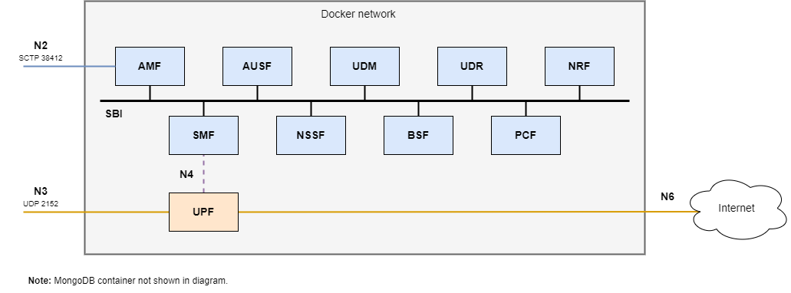

# Configuration guide

## Docker Compose configuration

### Network configuration

All the services are connected using a network called `open5gs` using the bridge driver and IPv4 addresses in the range 10.33.33.0/24. This network is destroyed with the Docker compose down command.

The `basic/` Docker compose deployment exposes three things:
- SCTP port 38412 for NGAP connections to the AMF
- UDP port 2152 for GTP connections to the UPF
- TCP port 27017 for connections to the mongo database

These ports are available in the loopback network of the host running Docker and the host itself exposes these ports for external connections.



### Database configuration

After building, the 5G Core will start without any user configured in the Open5GS mongo database.

The information for the database is kept in a Docker volume named `open5gs_db_data`, this way the information added to the database is persistent between restarts.

You can use the Open5GS `open5gs-dbctl` script in the host to add users to the database.

The database Docker volume is marked with a label `org.open5gs.mongodb_version` indicating the `MONGODB_VERSION` selected in the `.env` file. This marks the version used for the mongo container. This label is needed to debug issues with users changing the mongo container version but keeping the Docker volumes created.

> [!WARNING]
> When upgrading/downgrading the `MONGODB_VERSION` the existing `open5gs_db_data` and `open5gs_db_config` Docker volumes could cause problems/crashing. It is recommended to remove them.

### Network Function configuration

You can override the command being run in the container by using the command section in each service specified in the Docker compose file:
```yaml
  nssf:
    ...
    command: "-c /etc/open5gs/custom/nssf.yaml"
    ...
```

## The `basic` Docker Compose deployment

The `configs/basic/` configuration uses Open5GS 5G Network Functions without SCP.

The `configs/basic/upf.yaml` UPF config file is using the _advertise_ option with the `DOCKER_HOST_IP` environment variable present in the `.env` file (it is used through the `docker-host.external-ip` hosts entry). This configures the 5G Core to expect connections from external networks (not the docker network), through the host machine.

For Docker Compose deployments without external connections, such as `internal/packetrusher`, `internal/ueransim` or `network-slicing` the `DOCKER_HOST_IP` environment variable is ignored.

The files for the `basic` deployment `compose-files/basic/` contains the docker-compose.yaml files to work with Compose V2 using the Compose specification.

The `docker-compose.yaml` uses configs, the source config file present in `configs/basic/<nf>.yaml` and is mounted into the container path `/etc/open5gs/custom/<nf>.yaml`. This way you can try different configuration files without the need of rebuilding the Docker image.

## Helm configuration (for Kubernetes)

Each Helm chart comes with different values, some of them present per chart like the `image` or `config` values and some others are global like the `mobileNetwork` values. But all of these values can be configured through the `open5gs` chart. The `open5gs` chart includes all the charts as subcharts.

The `open5gs` charts values are explained below, to change specific values in the subcharts follow this structure or take a look to the `values.yaml` file located on each chart to see the list of possible values.

```yaml
global:
  containerPorts:
    db: 27017
    sbi: 80
    webui: 9999
  mobileNetwork:
    name: Open5GS
    plmn:
      mcc: "001"
      mnc: "01"
      tac: 1
      s_nssai:
        - sst: 1
          sd: "000001"
    dataNetwork:
      subnet: 10.45.0.0/16
      gateway: 10.45.0.1
      dnn: internet

db:
  enabled: true
  services:
    db:
      type: NodePort
      nodePort: 30007

webui:
  enabled: true
  services:
    webui:
      type: NodePort
      nodePort: 30999

nrf:
  enabled: true

ausf:
  enabled: true

bsf:
  enabled: true

nssf:
  enabled: true

pcf:
  enabled: true

udm:
  enabled: true

udr:
  enabled: true

amf:
  enabled: true
  services:
    ngap:
      type: LoadBalancer
      loadBalancerIP: 10.33.0.2
      provider: MetalLB

smf:
  enabled: true

upf:
  enabled: true
  services:
    gtpu:
      type: LoadBalancer
      loadBalancerIP: 10.33.0.3
      provider: MetalLB
```

Through this `values.yaml` file all the values inside the 5G Core are configured. The `global` values are shared by multiple Network Functions, e.g. the `containerPorts` values modify all the containers that make use of those ports. When changing the `sbi` value through the `global` values all the Network Functions on the SBI change its port to the one specified there.

Other options like `mobileNetwork` are shared between Network Functions, each one grabbing different parts but all of them sharing the same structure. Inside `mobileNetwork`, the `plmn` part uses `mnc`, `mcc` and `s_nssai` on the AMF chart but only `s_nssai` on the NSSF. Another example is the `dataNetwork` part, this part is used on the SMF and UPF Network Functions.

Each subchart comes defined with a value `enabled`, set it to true to deploy that subchart or set it to false to skip it.

This chart needs a Kubernetes PersistentVolume created for the database. You can create it "by hand" or use an StorageClass. An example of this PersistentVolume can be found on `misc/examples/k8s-db-pv/persistentvolume.yaml`.

You can also define your StorageClass using the following syntax on the database configuration. The following example lets you change the container image for the database Helm chart, configure the service to use a NodePort and use the storageClass `local-path` to create the Kubernetes PersistentVolume:

```yaml
db:
  enabled: true
  image:
    registry: ghcr.io
    repository: borjis131/db
    tag: "6.0.11"
  services:
    db:
      type: NodePort
      nodePort: 30007
  storage:
    volumeClaimTemplate:
      spec:
        storageClassName: "local-path"
        resources:
          requests:
            storage: 2Gi
        accessModes:
          - ReadWriteOnce
```
> [!NOTE]
> In this example, the local-path StorageClass being used comes from [here](https://github.com/rancher/local-path-provisioner)

Find a complete example to work with Raspberry Pi on `misc/examples/open5gs-chart/values.yaml`.

## Specific Network Function configuration

### AMF configuration

AMF container lets you choose if you want to enable/disable checksum offloading. Checksum offloading is enabled by default but can be disabled by setting the environment variable `DISABLE_CHECKSUM_OFFLOADING` to TRUE in the Docker compose AMF service:
```yaml
  amf:
    ...
    environment:
      - DISABLE_CHECKSUM_OFFLOADING=TRUE
    ...
```

### UPF configuration

UPF container lets you enable/disable NAT in the UPF. NAT in the UPF is enabled by default but can be disabled by setting the environment variable `DISABLE_NAT` to TRUE in the Docker compose UPF service:
```yaml
  upf:
    ...
    environment:
      - DISABLE_NAT=TRUE
    ...
```

Also the UPF container lets you choose between using TUN (default) as the device type or using TAP, by setting the environment variable `ENABLE_TAP` to TRUE in the Docker compose UPF service:
```yaml
  upf:
    ...
    environment:
      - ENABLE_TAP=TRUE
    ...
```

To enable TAP, the `dev` field on the `upf.yaml` `session` list must be present. The `dev` field can't be `ogstun` in this context.
```yaml
upf:
    ...
    session:
      - subnet: 10.45.0.0/16
        gateway: 10.45.0.1
        dev: ogstap
    ...
```

UPF container reads the subnets specified in the Open5GS config file and setups the network interfaces needed with the addresses specified and the NAT (or not) configuration:
```yaml
upf:
    ...
    session:
      - subnet: 10.45.0.0/16
        gateway: 10.45.0.1
    ...
```
