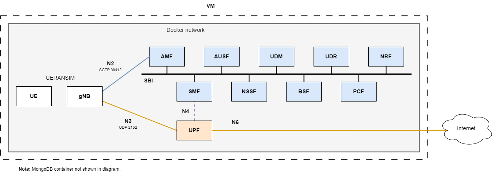

# Overview of the internal deployment

The `internal` deployment is prepared to work with internal gNBs (and UEs), only exposing the MongoDB database using `TCP port 27017`.

The `internal/ueransim` deployment works with [UERANSIM](https://github.com/aligungr/UERANSIM) using the gNB and UE images from [docker-ueransim](https://github.com/Borjis131/docker-ueransim).

The `internal/packetrusher` deployment works with [PacketRusher](https://github.com/HewlettPackard/PacketRusher) using the packetrusher image from [docker-packetrusher](https://github.com/Borjis131/docker-packetrusher).

Check [docker-packetrusher](https://github.com/Borjis131/docker-packetrusher) and follow the section `Important notes` to use this image. This image depends on a kernel module being installed on the host machine, the `free5gc's gtp5g kernel module`.

This deployment connects an emulated UE and gNB to the Open5GS 5G Core.

Check the [FAQ/How to use the UERANSIM container](../FAQ.md) and [FAQ/How to use the PacketRusher container](../FAQ.md) to see how to use the emulated UEs.