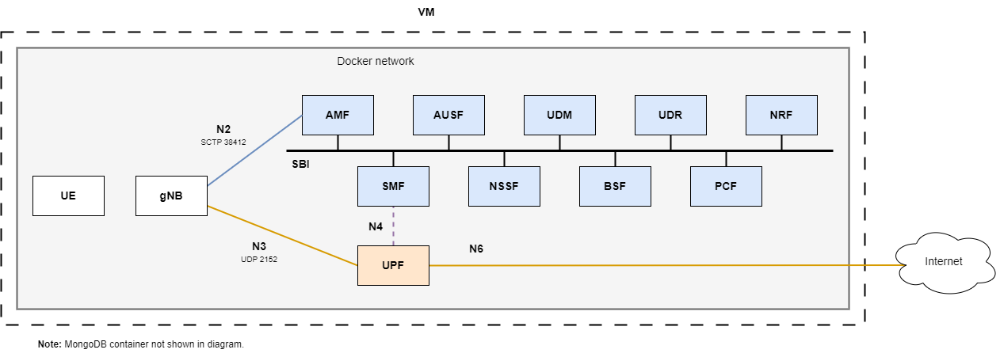

# Overview of the internal deployment

The `internal` deployment is prepared to work with internal gNBs (and UEs), only exposing the MongoDB database using `TCP port 27017`.

The `internal` deployment works with [UERANSIM](https://github.com/aligungr/UERANSIM) using the gNB and UE images from [docker-ueransim](https://github.com/Borjis131/docker-ueransim).

This deployment connects a UERANSIM UE to a UERANSIM gNB to the Open5GS 5G Core.