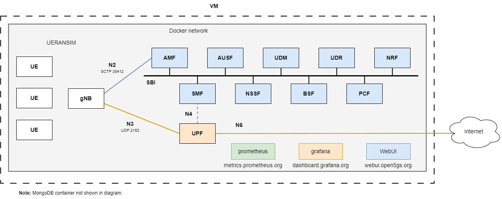

# Overview of the metrics deployment

The `metrics` deployment works with [UERANSIM](https://github.com/aligungr/UERANSIM) using the gNB and UE images from [docker-ueransim](https://github.com/Borjis131/docker-ueransim).

This deployment connects three emulated UE and a gNB to the Open5GS 5G Core. Using three different slices.

It also has a Prometheus server, Grafana server and the Open5GS WebUI.

The Prometheus server is using the Docker image `prom/prometheus:v2.51.0`. This Prometheus server is reachable from all the containers connected to the `open5gs` network in the Docker Compose deployment using the domain name `metrics.prometheus.org` and to the host using the port `9090`. This deployment creates the volume `open5gs_prometheus_data` each time is started. To restart the metrics, remove the volume and then restart the deployment.

The Grafana server is using the Docker image `grafana/grafana-oss:10.4.0`. This Grafana server is reachable from all the containers connected to the `open5gs` network in the Docker Compose deployment using the domain name `dashboard.grafana.org` and to the host using the port `3000`. The user configured is `user: admin` and `password: grafana`, this credentials can be changed from the `compose-files/metrics/docker-compose.yaml` Docker Compose file.

You can add more dashboards by creating them on the `configs/metrics/grafana/dashboards/` directory.

The Open5GS WebUI uses the image present on this repository. This WebUI is reachable from all the containers connected to the `open5gs` network in the Docker Compose deployment using the domain name `webui.open5gs.org` and to the host using the port `9999`. The user configured is `user: admin` and `password: 1423`.

The deployment has also a `logs/` directory configured to store all the Network Functions container logs.

## Common issues with the metrics deployment

### Issue 1: Slices not connected appearing on the Prometheus/Grafana metrics
Having the UE with a slice on the database makes it send metrics for that slice even if the UE has been registered to a different slice.

For example, if UE1 has slices `ST: 1, SD: 000001` and `ST: 1, SD: 000002` on the database, even if the UE1 only registers for the `ST: 1, SD: 000001` slice, both slices will appear on the Prometheus/Grafana metrics.
