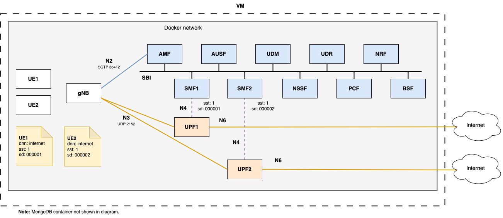

# Overview of the network slicing deployment



The `network-slicing` deployment is prepared to work with internal gNBs (and UEs), only exposing the MongoDB database using `TCP port 27017`.

This example is based on [s5uishida snssai upf sample](https://github.com/s5uishida/open5gs_5gc_ueransim_snssai_upf_sample_config).

The `network-slicing` deployment works with [UERANSIM](https://github.com/aligungr/UERANSIM) using the gNB and UE images from [docker-ueransim](https://github.com/Borjis131/docker-ueransim) and does not build the Docker images from this repository, instead it downloads the images present in the `ghcr.io/borjis131` registry, those images are the ones built from this repository.

This deployment connects two UERANSIM UEs (UE1 and UE2) to a UERANSIM gNB. The UEs are configured to select two different network slices, both present on the Open5GS 5G Core configuration files.

### UE1 configuration:
```yaml
dnn: internet
sst: 1
sd: 000001
```

### UE2 configuration:
```yaml
dnn: internet
sst: 1
sd: 000002
```

When this configuration is received in the 5G Core, the AMF uses it to select the appropiate SMF.

SMF1 is configured to serve the `sst: 1` and `sd: 000001`.

SMF1 is connected to UPF1, serving IP addresses at the DNN `internet` from the pool `10.45.0.0/24`.

SMF2 is configured to serve the `sst: 1` and `sd: 000002`.

SMF2 is connected to UPF2, serving IP addresses at the DNN `internet` from the pool `10.46.0.0/24`.

## Succesful operation

When testing this, *after adding the UEs to the database with the appropiate values*, `UE1` should receive IP address `10.45.0.2` and `UE2` should receive IP address `10.46.0.2`.
