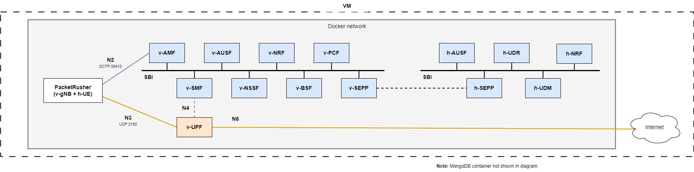

# Overview of the roaming deployment

The `roaming` deployment is prepared to work with Open5GS Local Breakout (LBO) Roaming feature and PacketRusher(gNB and UE), only exposing the MongoDB database using `TCP port 27017`.

Two 5G Cores are deployed for this example, one for the visited network (with PLMN 999 70) and one for the home network (with PLMN 001 01).

This example only deploys the minimum number of Network Functions in order to test the setup. One database is used, for the home network user authentication. So, in this case, the UE with IMSI 001011234567891 must be present on the database. The Roaming agreement is present on the visited network PCF (v-pcf) configuration file, under the `policy` section. That is because the visited network does not have any information for the user apart from that.

The communication between the two 5G Cores is done via the SEPP Network Functions.

Even though, the two SBI sections are separated in the diagram, only one docker network is created so in reality everything is interconnected. This is shown this way for a better understanding.
