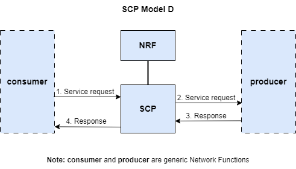
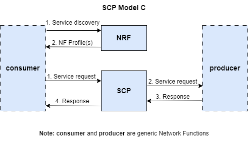

# Overview of the scp deployment

The `scp` deployment is prepared to work with external gNBs, exposing:
- `N2` control plane interface on the AMF using `SCTP port 38412`
- `N3` user plane  interface on the UPF using `UDP port 2152`

It also exposes the MongoDB database using `TCP port 27017`.

This deployment builds all the Docker images for the Network Functions, because the deployment `basic` lacks the SCP Network Function.

This deployment comes with two variants the `Model C` and the `Model D`.

The `Model D` or `indirect communication with delegated discovery`, makes all the Network Functions present in the 5G Core to perform the requests to the SCP and the SCP (acting like a proxy) forwards the request to the appropiate Network Function. In `Model D` this includes the Network Function discovery mechanisms, so the SCP will receive the discovery request and forward it to the NRF.

The `Model C` or `indirect communication`, makes all the Network Functions present in the 5G Core to perform the requests to the SCP and the SCP (acting like a proxy) forwards the request to the appropiate Network Function. But `Model C` still uses direct communication with the NRF for the Network Function discovery mechanisms.

More information can be read in this [Ericsson White Paper about indirect communication](https://www.ericsson.com/en/reports-and-papers/white-papers/indirect-communication-for-service-based-architecture-in-5g-core).