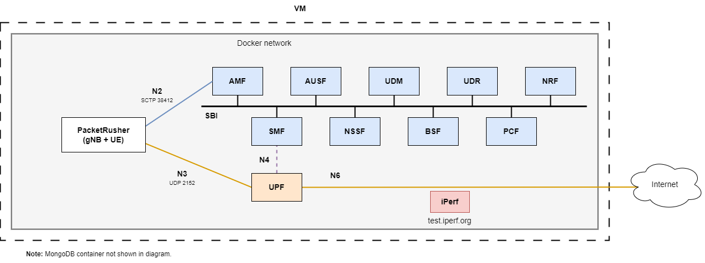

# Overview of the speed-test deployment



The `speed-test` deployment works with [PacketRusher](https://github.com/HewlettPackard/PacketRusher) using the packetrusher image from [docker-packetrusher](https://github.com/Borjis131/docker-packetrusher).

Check [docker-packetrusher](https://github.com/Borjis131/docker-packetrusher) and follow the section `Important notes` to use this image. This image depends on a kernel module being installed on the host machine, the `free5gc's gtp5g kernel module`.

This deployment connects an emulated UE and gNB to the Open5GS 5G Core.

It has an iPerf server connected using the Docker image `mlabbe/iperf3:latest`. This iPerf server is reachable from all the containers connected to the `open5gs` network in the Docker Compose deployment using the domain name `test.iperf.org`.

To perform a basic test, first check that all the containers in this deployment are running properly with:
```bash
docker ps -a
```

After checking the PacketRusher container and all the other containers are running, execute the following command to start an interactive session inside the PacketRusher container:
```bash
docker exec -it packetrusher bash
```

If the PacketRusher container is not up, check the [common issues with the PacketRusher container](#common-issues-with-the-packetrusher-container) section.

In this example, only one gNB and one UE are being emulated. PacketRusher lets you use the UE connection by executing commands inside the VRF created by the emulated gNB. If you check the logs after a successful deployment, you will see something like this:
```cmd
...
time="your-date" level=info msg="[UE][NAS] Receiving PDU Session Establishment Accept"
time="your-date" level=info msg="[UE][NAS] PDU session QoS RULES: [1 0 6 49 49 1 1 255 1]"
time="your-date" level=info msg="[UE][NAS] PDU session DNN: internet"
time="your-date" level=info msg="[UE][NAS] PDU session NSSAI -- sst: 1 sd: 001"
time="your-date" level=info msg="[UE][NAS] PDU address received: 10.45.0.2"
time="your-date" level=info msg="[GNB] Initiating PDU Session Resource Setup Response"
time="your-date" level=info msg="[UE][GTP] Interface val1234567891 has successfully been configured for UE 10.45.0.2"
time="your-date" level=info msg="[UE][GTP] You can do traffic for this UE using VRF vrf1234567891, eg:"
time="your-date" level=info msg="[UE][GTP] sudo ip vrf exec vrf1234567891 iperf3 -c IPERF_SERVER -p PORT -t 9000"
...
```

The important part is the last part:
```cmd
"[UE][GTP] You can do traffic for this UE using VRF vrf1234567891, eg:"
"[UE][GTP] sudo ip vrf exec vrf1234567891 iperf3 -c IPERF_SERVER -p PORT -t 9000"
```

In this example, you can connect to the VRF by executing the following command inside the PacketRusher container:
```bash
ip vrf exec vrf1234567891 bash
```

The numbers on the VRF are the MSIN value specified on the config file located at `configs/speed-test/packetrusher.yaml`.

You can perform an iPerf test inside the VRF to check the UE connection:
```bash
# inside the VRF of the PacketRusher container
iperf3 -c <IPERF_SERVER_IP_ADDRESS> -t 9000
```

The VRF does not resolve the domain names provided by Docker Compose. To retrieve the IP address of the `test.iperf.org` domain name, execute inside the PacketRusher container (outside of the VRF):
```bash
# inside the PacketRusher container
dig +short test.iperf.org
```

This will provide the IP address of the iperf container, after that specify it on the `<IPERF_SERVER_IP_ADDRESS>`.

It is a bit difficult to differentiate if you are executing things inside the VRF or on the PacketRusher container. A way to differentiate it after performing a test is that the bitrate difference between executing the iperf test inside the container and inside the VRF should be pretty significant.

In my specific deployment, executing the test inside the PacketRusher container gives a bitrate around 22 Gbit/s and executing it inside the VRF gives a bitrate around 450 Mbit/s.

## Common issues with the PacketRusher container

### Issue 1: PacketRusher container version VS PacketRusher host version
Some issues appear due to not having the same version of PacketRusher being installed on the host machine (free5gc's gtp5g kernel module) and the PacketRusher version being compiled for the Docker image. The current image uses the PacketRusher tag `20240521`, so make sure to checkout to this version for the PacketRusher being installed on the host machine.

### Issue 2: Cannot allocate memory
Sometimes this error appears:
```cmd
time="your-date" level=info msg="[GNB][GTP] Unable to create Kernel GTP interface: cannot allocate memory1234567891val1234567891"
```

I do not know why this error happens, restarting the Docker Compose deployment fixes the issue.
