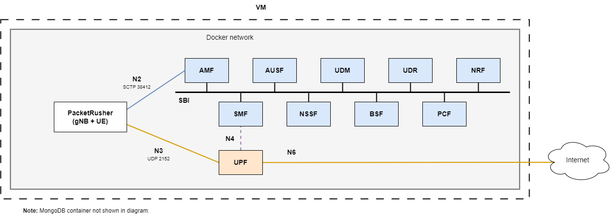

> Note: The following text has information extracted from Open5GS and PacketRusher configuration files.

# Overview of the suci deployment



The `suci` deployment works with [PacketRusher](https://github.com/HewlettPackard/PacketRusher) using the packetrusher image from [docker-packetrusher](https://github.com/Borjis131/docker-packetrusher).

Check [docker-packetrusher](https://github.com/Borjis131/docker-packetrusher) and follow the section `Important notes` to use this image. This image depends on a kernel module being installed on the host machine, the `free5gc's gtp5g kernel module`.

This deployment connects an emulated UE and gNB to the Open5GS 5G Core and configures it to use SUCI with ECIES Profile A.

In order to avoid IMSI-catchers, 5G implements encryption mechanisms for the SUPI (Subscriber Permanent Identifier) and sends the encrypted identifier called SUCI (Subscription Concealed Identifier).

SUCI format is: suci-<supi_type>-<MCC>-<MNC>-<routing_indicator>-<protection_scheme>-<public_key_id>-<scheme_output>

To create the SUCI, three different protection schemes exist:
- 0: No protection
- 1: ECIES Profile A (ECIES with Curve25519, curve25519-X.key)
- 2: ECIES Profile B (ECIES with NIST P-256 curve, secp256r1-X.key)

The keys for the protection schemes are stored in the `suci` deployment configs directory, inside the hnet directory. Six different keys are available, three for profile A and three for profile B. These keys are available for the UDM container using a volume to map the hnet directory into the container.

Other relevant parameters for SUCI are:
SUCI Routing Indicator: allows the AMF to route the UE to the correct UDM
routingindicator: "0000"

The ID being used in the UDM configuration file:
homeNetworkPublicKeyID: 1

The public key for the key selected:
homeNetworkPublicKey: "e421686f6fb2d70e3fa28d940494095686c3179fef53514667a6ed106b8a7d3d"

Public keys can be viewed with the following commands:

```bash
$ openssl pkey -in hnet/curve25519-1.key -text_pub -noout
$ openssl ec -in hnet/secp256r1-2.key -conv_form compressed -text_pub -noout
```

With default configuration, SUCI sent to AMF will be suci-0-001-01-0000-0-0-1234567891
